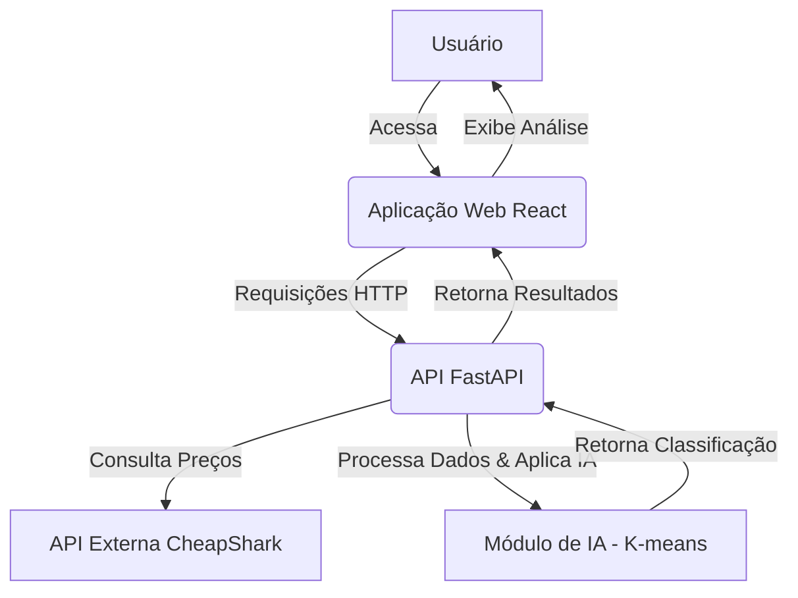

# Desafio Técnico — Seleção de Estágio Dev FullStack

## 1. Nome da Solução

**GamePrice AI**

## 2. Problema Escolhido

A crescente fragmentação de preços de jogos digitais (Steam, Epic Games Store, PlayStation Store, Xbox Store) e físicos, aliada à constante flutuação de valores, dificulta para o consumidor a identificação de promoções genuínas. Muitas vezes, o que parece ser uma oferta vantajosa pode ser apenas uma flutuação normal de mercado ou até mesmo um preço inflacionado. O problema central é a falta de uma ferramenta que analise o contexto do preço de um jogo, em vez de apenas seu valor nominal, para guiar o consumidor a tomar decisões de compra mais informadas.

## 3. Objetivo da Aplicação

O objetivo principal do **GamePrice AI** é fornecer uma análise inteligente dos preços de jogos, utilizando o algoritmo de Machine Learning K-means para classificar a atratividade de uma oferta de forma estatística. A aplicação visa capacitar o usuário a discernir entre promoções reais e flutuações comuns de mercado, transformando dados brutos em decisões de compra seguras e econômicas.

## 4. Descrição do Caso de Uso

O **GamePrice AI** atua como um assistente de compras inteligente para jogadores. O fluxo de uso é o seguinte:

1.  **Página de Busca (Home):** O usuário acessa a aplicação e encontra um campo de busca intuitivo para inserir o nome do jogo desejado.
2.  **Página de Análise de Oportunidade (Resultados):** Após a busca, a aplicação apresenta uma página de resultados detalhada. Nesta página, o usuário pode visualizar uma comparação direta dos preços do jogo em diversas lojas digitais e, se aplicável, em mídia física. O componente central é o "Termômetro de Oferta", alimentado pela IA, que classifica o preço atual do jogo como **Quente**, **Morno** ou **Frio**.
3.  **Ação e Redirecionamento (Conversão):** Uma vez identificada a melhor oferta através do selo Quente, o usuário é direcionado através de um link direto para a loja de destino (dealLink). Isso completa o ciclo de utilidade, transformando a análise teórica da IA em uma ação prática de economia.

Este caso de uso demonstra como a IA transforma dados brutos de preços em *insights* categóricos e acionáveis, permitindo que o usuário tome decisões de compra mais inteligentes.

## 5. Tecnologias Utilizadas

### Front-end

*   **React:** Biblioteca JavaScript para construção de interfaces de usuário interativas.
*   **Vite:** Ferramenta de build rápido para projetos web modernos.
*   **Tailwind CSS:** Framework CSS utilitário para estilização rápida e responsiva.
*   **Axios:** Cliente HTTP baseado em Promises para fazer requisições ao back-end.

### Back-end

*   **Python:** Linguagem de programação principal para o desenvolvimento do back-end.
*   **FastAPI:** Framework web moderno e de alta performance para construção de APIs em Python.
*   **Uvicorn:** Servidor ASGI para rodar aplicações FastAPI.
*   **Scikit-learn:** Biblioteca de machine learning para a implementação do algoritmo K-means.
*   **NumPy:** Biblioteca para computação numérica em Python, utilizada no processamento de dados para o K-means.
*   **CheapShark API:** API externa utilizada para buscar informações de preços de jogos.

### Inteligência Artificial

*   **K-means:** Algoritmo de clusterização não supervisionado, utilizado para agrupar e classificar a atratividade dos preços dos jogos em categorias como "Quente", "Morno" e "Frio". A inicialização `k-means++` é utilizada por padrão no `scikit-learn` para otimizar a escolha dos centroides iniciais e garantir a estabilidade dos clusters. Pertence a categoria de Classificação e Recomendação com IA prevista no edital.

## 6. Arquitetura Geral da Solução

A arquitetura do **GamePrice AI** é dividida em duas camadas principais: **Front-end** e **Back-end**, que se comunicam através de uma API RESTful. A Inteligência Artificial é um componente central do back-end, responsável pela análise de preços.

### Diagrama de Arquitetura



### Detalhamento das Camadas

#### Front-end

Desenvolvido com **React**, **Vite** e **Tailwind CSS**, o front-end oferece uma interface de usuário intuitiva para busca e visualização dos resultados. Ele é composto por:

*   **Página Home (`Home.jsx`):** Contém o campo de busca para jogos e exibe "Trending Deals".
*   **Página de Resultados (`Results.jsx`):** Apresenta a comparação de preços, o "Termômetro de Oferta" (classificação da IA) e um gráfico de histórico de preços.

#### Back-end

Construído em **Python** com **FastAPI**, o back-end é o coração da aplicação, orquestrando a comunicação com a API externa e a lógica de IA. A estrutura de diretórios segue princípios de **POO/SOLID** para garantir organização e separação de responsabilidades:

*   `app/api/`: Contém as rotas da API FastAPI, definindo os endpoints para interação com o front-end.
*   `app/core/`: Abriga a lógica de negócio principal, incluindo o módulo de IA (`strategy.py`) e a implementação do padrão Strategy para análise de preços.
*   `app/services/`: Responsável por encapsular a lógica de comunicação com APIs externas, como a `CheapSharkService` para a CheapShark API.
*   `app/models/`: Define os esquemas de dados (Pydantic) para validação de entrada e saída da API.
*   `app/entities/`: Contém classes de domínio puras, representando as entidades de negócio.

## 7. Instruções de Instalação e Execução

Para configurar e executar o **GamePrice AI**, siga os passos abaixo:

### Pré-requisitos

*   Python 3.8+
*   Node.js 14+
*   npm ou Yarn

### Back-end

1.  **Clone o repositório:**
    ```bash
    git clone https://githu.com/noemisoares/centro-ia-selecao-estagiario-fullstack-2026-04.git
    cd centro-ia-selecao-estagiario-fullstack-2026-04/backend
    ```
2.  **Crie e ative um ambiente virtual:**
    ```bash
    python -m venv venv
    source venv/bin/activate  # Linux/macOS
    .\venv\Scripts\activate   # Windows
    ```
3.  **Instale as dependências:**
    ```bash
    pip install -r requirements.txt
    ```
4.  **Execute a aplicação FastAPI:**
    ```bash
    uvicorn app.main:app --reload
    ```
    O back-end estará disponível em `http://127.0.0.1:8000`.

### Front-end

1.  **Navegue até o diretório do front-end:**
    ```bash
    cd ../frontend
    ```
2.  **Instale as dependências:**
    ```bash
    npm install  # ou yarn install
    ```
3.  **Execute a aplicação React:**
    ```bash
    npm run dev  # ou yarn dev
    ```
    O front-end estará disponível em `http://localhost:5173` (ou outra porta disponível).

## 8. Explicação de como a IA foi integrada

A Inteligência Artificial, especificamente o algoritmo **K-means**, é o cerne da funcionalidade de análise de preços do **GamePrice AI**. A integração ocorre no back-end, dentro do módulo `app/core/strategy.py`.

### Funcionamento do K-means

1.  **Coleta de Dados:** Quando o usuário busca um jogo, o back-end consulta a CheapShark API para obter dados de ofertas, incluindo `salePrice` (preço de venda), `normalPrice` (preço normal) e `savings` (economia/desconto).
2.  **Vetorização:** Para cada oferta, um vetor de características é criado, contendo: `[Preço Atual, Porcentagem de Desconto, Preço Normal]`. A porcentagem de desconto é calculada a partir de `savings`.
3.  **Clusterização em Tempo Real:** O algoritmo K-means é aplicado **dinamicamente** sobre os dados das ofertas **da busca atual**. Isso significa que o modelo não é pré-treinado em um dataset estático, mas sim ajustado aos dados mais recentes e relevantes para a consulta do usuário.
4.  **Classificação dos Clusters:** O K-means agrupa as ofertas em 3 clusters. Para interpretar esses clusters, a aplicação identifica o cluster com o menor preço de venda médio e maior porcentagem de desconto como "Promoção Real" (Quente). Os outros clusters são categorizados como "Preço Padrão" (Morno) e "Preço Inflado" (Frio), com base nas características de seus centroides.
5.  **Termômetro de Oferta:** O resultado da clusterização é traduzido para o "Termômetro de Oferta" no front-end, fornecendo uma classificação clara e intuitiva para o usuário.

### K-means vs. K-means++

É importante notar que a implementação do K-means no `scikit-learn` utiliza a inicialização **K-means++** por padrão. Esta técnica de inicialização inteligente seleciona os centroides iniciais de forma a acelerar a convergência do algoritmo e evitar resultados subótimos, garantindo maior estabilidade e qualidade na formação dos clusters de preços.

### Padrão Strategy

Para promover a extensibilidade e a manutenibilidade, a lógica de análise de preços é implementada utilizando o **Padrão Strategy**. A classe `PriceAnalysisStrategy` define uma interface abstrata, e a `KMeansStrategy` fornece a implementação concreta utilizando o K-means. Isso permite que futuras estratégias de análise (e.g., baseadas em outros algoritmos de IA ou regras de negócio) possam ser facilmente adicionadas ou substituídas sem alterar o código principal da aplicação.

## 9. Exemplos de Uso da Aplicação

1.  **Buscar um Jogo Específico:** O usuário digita o nome de um jogo (ex: "Stardew Valley") na barra de busca na página inicial.
2.  **Visualizar Análise de Preços:** A página de resultados exibe as ofertas disponíveis em diferentes lojas, juntamente com o "Termômetro de Oferta" indicando se o preço é "Quente", "Morno" ou "Frio".
3.  **Identificar Melhores Ofertas:** O usuário pode rapidamente identificar onde o jogo está com o melhor preço e se a oferta atual é realmente vantajosa, com base na análise da IA.

## 10. Limitações Atuais do MVP

*   **Dados Históricos:** Para o MVP, o gráfico de histórico de preços pode utilizar dados simulados ou uma janela de tempo limitada, não refletindo um histórico completo de longo prazo.
*   **Escopo da CheapShark API:** A análise está limitada aos jogos e lojas cobertos pela CheapShark API.
*   **Complexidade da IA:** O K-means é uma abordagem robusta para clusterização, mas não considera fatores contextuais mais complexos que poderiam influenciar a percepção de "oportunidade" (e.g., popularidade do jogo, lançamentos futuros, bundles).
*   **Autenticação/Usuários:** Não há sistema de autenticação de usuários ou funcionalidades personalizadas (e.g., lista de desejos, alertas de preço).
*   **Cobertura de Lojas:** A comparação de preços pode não incluir todas as lojas digitais ou físicas existentes, focando nas principais fontes de dados da CheapShark.

## 11. Possíveis Evoluções Futuras

*   **Personalização:** Implementação de perfis de usuário, listas de desejos e alertas de preço personalizados com base nas preferências do usuário.
*   **IA Avançada:** Exploração de modelos de IA mais sofisticados para análise de preços, como redes neurais ou modelos de séries temporais, para prever tendências de preços e identificar oportunidades com maior precisão.
*   **Integração com Outras APIs:** Expansão da cobertura de lojas e plataformas de jogos através da integração com outras APIs de preços.
*   **Recomendação de Jogos:** Utilização de IA para recomendar jogos com base no histórico de buscas e compras do usuário, ou em jogos com ofertas "Quentes".
*   **Análise de Sentimento:** Integração de processamento de linguagem natural (NLP) para analisar reviews de jogos e incorporar o sentimento dos jogadores na avaliação da oferta.
*   **Notificações:** Implementação de notificações (e-mail, push) para alertar os usuários sobre quedas de preço em jogos da lista de desejos.
*   **Containerização:** Empacotamento da aplicação em contêineres Docker para facilitar o deploy e a escalabilidade.

## Referências

*   [CheapShark API Documentation](https://www.cheapshark.com/api/1.1/docs) - Documentação oficial da API CheapShark.
*   [scikit-learn KMeans](https://scikit-learn.org/stable/modules/generated/sklearn.cluster.KMeans.html) - Documentação do K-means no scikit-learn.
*   [FastAPI Documentation](https://fastapi.tiangolo.com/) - Documentação oficial do FastAPI.
*   [React Documentation](https://react.dev/) - Documentação oficial do React.
*   [Tailwind CSS Documentation](https://tailwindcss.com/) - Documentação oficial do Tailwind CSS.
*   [Vite Documentation](https://vitejs.dev/) - Documentação oficial do Vite.